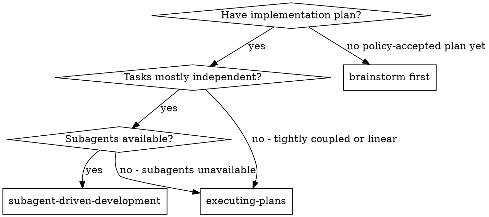
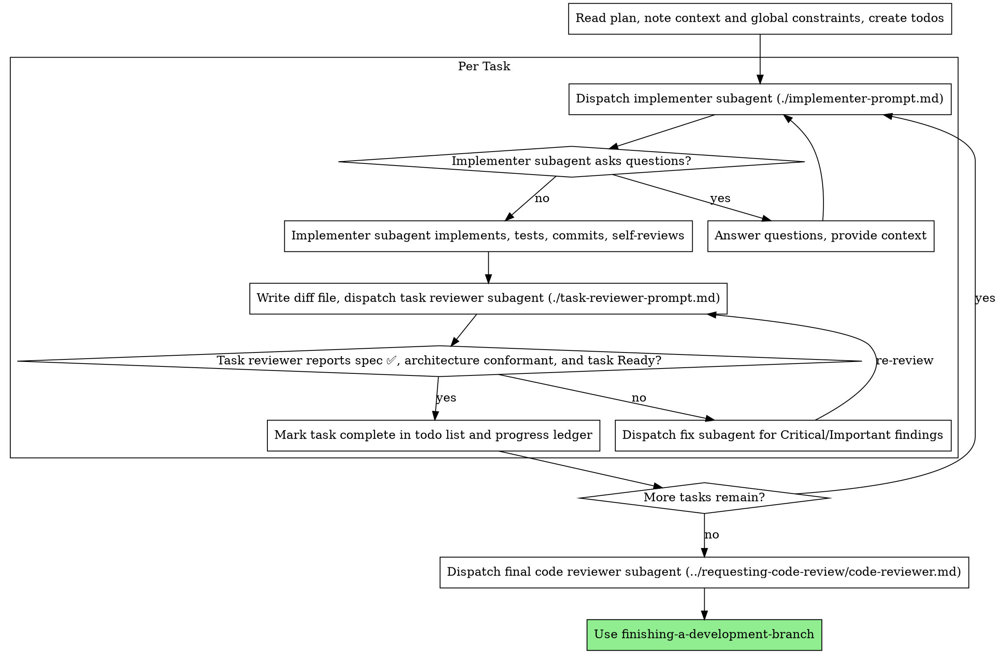

# Subagent-Driven Development

## Required Input

Resolve the effective **Approval Policy** and start only from a policy-accepted
Implementation Plan path and exact `sha256:` revision. Autonomous accepts Ready
or Approved; Review-gated accepts Approved. Resolve the sibling
`using-superpowers` operation module and validate the plan with explicit policy
before reading it for instructions. Draft never executes.

After plan validation, parse only these header bindings:

- `Spec` and `Spec Revision`;
- `Foundation Manifest`;
- `Foundation Base Revision`;
- `Foundation Result Revision`; and
- `Foundation Application Receipt`.

Validate the source artifact as a policy-accepted `Design Spec` at the recorded
exact revision and same policy. Parse its `Foundation Manifest` and `Base Agentic Foundation`
traceability fields. Compare the source-spec base to the plan base, then bind
the plan's distinct result revision and receipt supplied by the phase handoff.
All four Foundation fields must be literal `none` for a generic workflow.
Otherwise require the same absolute physical `WAYFINDING.md`, complete
lowercase base and result `sha256:` identities, and the absolute physical
candidate-root `APPLIED.json`. Reject a half-none or otherwise inconsistent
Foundation binding before further inspection.

Never require base and result revisions to be equal. A non-empty candidate
normally changes the revision; an empty candidate may preserve it when the
receipt proves that exact result.

For a non-none Foundation, verify the receipt is ignored and run the sibling
shared operation:

```text
git check-ignore --quiet <absolute-candidate-root-APPLIED.json>
foundation validate --root <checkout-root> --manifest <absolute-WAYFINDING.md> --expected-revision <exact-result-sha256> --receipt <absolute-candidate-root-APPLIED.json> --spec-path <absolute-spec-path> --expected-spec-revision <exact-spec-sha256> --expected-base-revision <exact-base-sha256> --policy <Autonomous|Review-gated>
```

Only after plan, source-spec, and non-none receipt-backed Foundation validation
pass may you read the plan, referenced spec, Foundation, and codebase from disk.
Do not rely on prior conversation context, even in same-session mode after plan
progression.

If either artifact is Draft, has missing or duplicated lifecycle metadata, has
the wrong type, was edited after lifecycle progression, or is at a different revision, stop
and report expected and actual values. Also stop on a missing, non-ignored,
inconsistent, or drifted Foundation base/result/receipt binding. Missing Node.js
or a missing operation module fails closed with the full-package installation
guidance.

## Local Superpowers Docs Guard

Before each task commit, inspect staged files. If any path under `docs/superpowers/` is staged, unstage it unless the user explicitly requested committing local Superpowers docs.

Use:

```bash
git diff --cached --name-only
git restore --staged docs/superpowers 2>/dev/null || true
```

Execute the plan by requesting an isolated implementer subagent per task, a task review (spec compliance + architecture conformance + code quality) after each, and a broad whole-branch review at the end through the host-neutral dispatch contract.

## Portable SDD Operations

The shared Node module under `../using-superpowers/scripts/` owns SDD workspace,
task extraction, review packaging, and durable progress behavior. Use the thin
launcher for the active host; never reconstruct these operations with AWK,
shell redirection, `cat`, or ad hoc Git command strings.

| Operation | Bash/Git Bash/WSL/Unix | Windows cmd/PowerShell |
| --- | --- | --- |
| Resolve workspace | `scripts/sdd-workspace` | `scripts/sdd-workspace.cmd` |
| Extract bound task | `scripts/task-brief PLAN_FILE N OUTFILE BINDING_FILE` | `scripts/task-brief.cmd PLAN_FILE N OUTFILE BINDING_FILE` |
| Build bound review package | `scripts/review-package BASE HEAD OUTFILE BINDING_FILE` | `scripts/review-package.cmd BASE HEAD OUTFILE BINDING_FILE` |
| Read progress | `scripts/progress read` | `scripts/progress.cmd read` |
| Mark complete | `scripts/progress complete --task N --base BASE --head HEAD --review clean` | `scripts/progress.cmd complete --task N --base BASE --head HEAD --review clean` |

Task, review, and progress operations return JSON containing their artifact path
and result. The workspace operation prints the absolute workspace path for use
by launchers and prompts. All correctness-critical launchers require Node.js 20
or newer. If Node is unavailable, they exit nonzero and print exactly:

```text
Superpowers Architecture requires Node.js 20 or newer. Install Node.js, then retry this correctness-critical operation.
```

Stop when this happens. Do not create a brief, review package, or progress file
through a manual fallback.

New controllers always pass the exact v2 SDD binding from `writing-plans`. The
shared operation validates policy, plan, spec, and optional Foundation/receipt
before it renders a brief or review package, and extracts task text from the one
validated plan snapshot. Legacy positional calls remain only for legacy
controllers; do not omit the binding in a new workflow.

**Why subagents:** You delegate tasks to specialized agents with a requested isolated context. Precisely craft the bounded prompt and artifact paths so the runtime adapter can verify that parent conversation turns were not inherited. If the host cannot prove isolation, report the reduced guarantee instead of promising it. This also preserves your own context for coordination work.

**Core principle:** Fresh subagent per task + task review (spec + architecture + quality) + broad final review = high quality, fast iteration

**Narration:** between tool calls, narrate at most one short line — the
ledger and the tool results carry the record.

**Continuous execution:** Do not pause to check in with the user between tasks. Execute all tasks from the plan without stopping. The only reasons to stop are: BLOCKED status you cannot resolve, ambiguity that genuinely prevents progress, or all tasks complete. "Should I continue?" prompts and progress summaries waste their time — they asked you to execute the plan, so execute it.

## When to Use



**vs. Executing Plans (linear or no-subagent fallback):**
- Mostly tightly coupled tasks or plans that need sequential control
- Falls back here when subagents are unavailable
- Fresh subagent per task (no context pollution)
- Review after each task (spec compliance + architecture conformance + code quality), broad review at the end
- Faster iteration (no human-in-loop between tasks)

## The Process



## Pre-Flight Plan Review

Before dispatching Task 1, scan the plan once for conflicts:

- tasks that contradict each other or the plan's Global Constraints
- anything the plan explicitly mandates that the review rubric treats as a
  defect (a test that asserts nothing, verbatim duplication of a logic block)

Under Autonomous, repair in-scope plan contradictions, refresh, review, return
the plan to Ready, and continue. Ask the user only when the conflict changes the
authorized goal, acceptance criteria, safety boundary, or consequential product
behavior. Under Review-gated, a changed plan returns to its readable review
flow. If the scan is clean, proceed without comment.

If implementation reveals that the bound modules, interfaces, seams, adapters,
data flow, or test surface must change, stop only the divergent work. Run
`artifact draft` on the controlling spec and dependent plan, record and review
the correction, then return to Ready under Autonomous or the readable user
review flow under Review-gated. Resume only from newly policy-accepted revisions.

## Dispatch Contract and Capability Selection

Every dispatch uses the request shape in `../using-superpowers/references/dispatch-contract.md`. Implementers and reviewers normally use `contextPolicy: isolated`; writers use `workspacePolicy: shared-checkout` and must run sequentially, while reviewers use `workspacePolicy: read-only-review`.

An explicit user model choice wins. Otherwise select a capability tier and let the active runtime adapter map only to choices advertised by that host:

- Complete mechanical work in one or two files: `fast`.
- Multi-file integration, debugging, or ordinary task review: `balanced`.
- Architecture-sensitive work and the final whole-branch review: `strongest-available`.

Do not name or invent a model in this shared skill. If the adapter cannot map a tier, it preserves the runtime default and discloses the reduced guarantee. If isolation cannot be proven, stop for roles that require independent judgment or use the owning workflow's deterministic fallback.

## Handling Implementer Status

Implementer subagents report one of four statuses. Handle each appropriately:

**DONE:** Generate the review package through the active host launcher (`scripts/review-package BASE HEAD` or `scripts/review-package.cmd BASE HEAD`, from this skill's directory). Read the unique `path` in its JSON result. BASE is the commit you recorded before dispatching the implementer — never `HEAD~1`, which silently drops all but the last commit of a multi-commit task. Then dispatch the task reviewer with that path.

**DONE_WITH_CONCERNS:** The implementer completed the work but flagged doubts. Read the concerns before proceeding. If the concerns are about correctness or scope, address them before review. If they're observations (e.g., "this file is getting large"), note them and proceed to review.

**NEEDS_CONTEXT:** The implementer needs information that wasn't provided. Provide the missing context and re-dispatch.

**BLOCKED:** The implementer cannot complete the task. Assess the blocker:
1. If it's a context problem, provide more context and re-dispatch with the same model
2. If the task requires more reasoning, re-dispatch with a more capable model
3. If the task is too large, break it into smaller pieces
4. If the plan itself is wrong, correct and re-review it under Approval Policy;
   ask the user only for a goal/constraint decision

**Never** ignore an escalation or force the same model to retry without changes. If the implementer said it's stuck, something needs to change.

## Handling Reviewer ⚠️ Items

The task reviewer may report "⚠️ Cannot verify from diff" items — requirements
that live in unchanged code or span tasks. These do not block the rest of the
review, but you must resolve each one yourself before marking the task
complete: you hold the plan and cross-task context the reviewer
lacks. If you confirm an item is a real gap, treat it as a failed spec
review — send it back to the implementer and re-review.

## Constructing Reviewer Prompts

Per-task reviews are task-scoped gates. The broad review happens once, at the
final whole-branch review. When you fill a reviewer template:

- Do not add open-ended directives like "check all uses" or "run race tests
  if useful" without a concrete, task-specific reason
- Do not ask a reviewer to re-run tests the implementer already ran on the
  same code — the implementer's report carries the test evidence
- Do not pre-judge findings for the reviewer — never instruct a reviewer to
  ignore or not flag a specific issue. If you believe a finding would be a
  false positive, let the reviewer raise it and adjudicate it in the review
  loop. If the prompt you are writing contains "do not flag," "don't treat X
  as a defect," "at most Minor," or "the plan chose" — stop: you are
  pre-judging, usually to spare yourself a review loop.
- The global-constraints block you hand the reviewer is its attention
  lens. Copy the binding requirements verbatim from the plan's Global
  Constraints section or the spec: exact values, exact formats, and the
  stated relationships between components ("same layout as X", "matches
  Y"). The reviewer's template already carries the process rules (YAGNI,
  test hygiene, review method) — the constraints block is for what THIS
  project's spec demands.
- Give every implementer, task reviewer, and final reviewer the exact policy-accepted
  spec/plan paths and revisions, the plan's exact Foundation Manifest,
  Foundation Base Revision, Foundation Result Revision, and Foundation
  Application Receipt, plus the shared
  `codebase-design/ARCHITECTURE-CONFORMANCE.md` path. Copy the task-specific
  bound modules, interfaces, seams/adapters, data flow,
  depth/locality/leverage intent, and test surface into the bounded prompt.
  Any `violation` blocks completion; a design change requires a newly
  policy-accepted artifact revision before work continues.
- Hand the reviewer its diff as a file: run this skill's portable
  review-package operation through the active host launcher and pass the
  reviewer the `path` in its JSON result. The output never enters your own
  context, and the reviewer sees
  the commit list, stat summary, and full diff with context in one Read
  call. Use the BASE you recorded before dispatching the implementer —
  never `HEAD~1`, which silently truncates multi-commit tasks.
- A dispatch prompt describes one task, not the session's history. Do not
  paste accumulated prior-task summaries ("state after Tasks 1-3") into
  later dispatches — a real session's dispatch hit 42k chars of which 99%
  was pasted history. A fresh subagent needs its task, the interfaces it
  touches, and the global constraints. Nothing else.
- Dispatch fix subagents for Critical and Important findings. Record Minor
  findings in the progress ledger as you go, and point the final
  whole-branch review at that list so it can triage which must be fixed
  before merge. A roll-up nobody reads is a silent discard.
- A finding labeled plan-mandated, or any finding that conflicts with the plan,
  returns through the same policy-aware correction flow. Under Autonomous,
  repair an in-scope technical conflict and re-review. Ask the user only when
  deciding which side governs changes the goal, constraints, or consequential
  product behavior.
- The final whole-branch review gets a package too: run
  `scripts/review-package MERGE_BASE HEAD` (MERGE_BASE = the commit the
  branch started from, e.g. `git merge-base main HEAD`) and include the
  printed path in the final review dispatch, so the final reviewer reads
  one file instead of re-deriving the branch diff with git commands.
- Every fix dispatch carries the implementer contract: the fix subagent
  re-runs the tests covering its change and reports the results. Name the
  covering test files in the dispatch — a one-line fix does not need the
  whole suite. Before re-dispatching the reviewer, confirm the fix report
  contains the covering tests, the command run, and the output; dispatch
  the re-review once all three are present.
- If the final whole-branch review returns findings, dispatch ONE fix
  subagent with the complete findings list — not one fixer per finding.
  Per-finding fixers each rebuild context and re-run suites; a real
  session's final-review fix wave cost more than all its tasks combined.

## File Handoffs

Everything you paste into a dispatch prompt — and everything a subagent
prints back — stays resident in your context for the rest of the session
and is re-read on every later turn. Hand artifacts over as files:

- **Task brief:** before dispatching an implementer, run this skill's portable
  task-brief operation through the active host launcher. It extracts the task's
  full text to a uniquely named file and returns the path in JSON. Compose the dispatch so the
  brief stays the single source of requirements. Your dispatch should
  contain: (1) one line on where this task fits in the project; (2) the
  brief path, introduced as "read this first — it is your requirements,
  with the exact values to use verbatim"; (3) interfaces and decisions
  from earlier tasks that the brief cannot know; (4) your resolution of
  any ambiguity you noticed in the brief; (5) the report-file path and
  report contract. Exact values (numbers, magic strings, signatures, test
  cases) appear only in the brief.
- **Report file:** name the implementer's report file after the brief
  (brief `…/task-N-brief.md` → report `…/task-N-report.md`) and put it in
  the dispatch prompt. The implementer writes the full report there and
  returns only status, commits, a one-line test summary, and concerns.
- **Reviewer inputs:** the task reviewer gets the same brief, report, review
  package, exact policy-accepted spec, exact policy-accepted plan, shared Architecture
  Conformance rubric, and exact Foundation Manifest, Foundation Base Revision,
  Foundation Result Revision, and Foundation Application Receipt — plus the
  global constraints and task-specific architecture binding. All four use
  literal `none` for a generic workflow.
- Fix dispatches append their fix report (with test results) to the same
  report file and return a short summary; re-reviews read the updated file.

## Durable Progress

Conversation memory does not survive compaction. In real sessions,
controllers that lost their place have re-dispatched entire completed task
sequences — the single most expensive failure observed. Track progress in
a ledger file, not only in todos.

- At skill start, run the active host's `progress read` operation. Tasks in its
  `entries` result are DONE — do not re-dispatch them; resume at the first task
  not marked complete. If `unparsedLines` is nonempty, stop and reconcile the
  legacy recovery state before dispatching or marking anything; the operation
  will not overwrite an unrecognized ledger.
- When a task's review comes back clean, run `progress complete --task N --base
  BASE --head HEAD --review clean` through the active host launcher in the same
  message as your other bookkeeping. The operation validates the revisions,
  replaces any prior entry for that task, and atomically replaces the ledger.
- The ledger is your recovery map: the commits it names exist in git even
  when your context no longer remembers creating them. After compaction,
  trust the ledger and `git log` over your own recollection.
- `git clean -fdx` will destroy the ledger (it's git-ignored scratch); if
  that happens, recover from `git log`.

## Prompt Templates

- [implementer-prompt.md](implementer-prompt.md) - Dispatch implementer subagent
- [task-reviewer-prompt.md](task-reviewer-prompt.md) - Dispatch task reviewer subagent (spec compliance + architecture conformance + code quality)
- Final whole-branch review: use `requesting-code-review` and [code-reviewer.md](../requesting-code-review/code-reviewer.md)

## Example Workflow

```
You: I'm using Subagent-Driven Development to execute this plan.

[Read plan file once: docs/superpowers/plans/feature-plan.md]
[Create todos for all tasks]

Task 1: Hook installation script

[Run task-brief for Task 1; dispatch implementer with brief + report paths + context]

Implementer: "Before I begin - should the hook be installed at user or system level?"

You: "User level (~/.config/superpowers/hooks/)"

Implementer: "Got it. Implementing now..."
[Later] Implementer:
  - Implemented install-hook command
  - Added tests, 5/5 passing
  - Self-review: Found I missed --force flag, added it
  - Committed

[Run review-package, dispatch task reviewer with the printed path]
Task reviewer: Spec ✅ - all requirements met, nothing extra.
  Strengths: Good test coverage, clean. Issues: None. Task quality: Ready.

[Mark Task 1 complete]

Task 2: Recovery modes

[Run task-brief for Task 2; dispatch implementer with brief + report paths + context]

Implementer: [No questions, proceeds]
Implementer:
  - Added verify/repair modes
  - 8/8 tests passing
  - Self-review: All good
  - Committed

[Run review-package, dispatch task reviewer with the printed path]
Task reviewer: Spec ❌:
  - Missing: Progress reporting (spec says "report every 100 items")
  - Extra: Added --json flag (not requested)
  Issues (Important): Magic number (100)

[Dispatch fix subagent with all findings]
Fixer: Removed --json flag, added progress reporting, extracted PROGRESS_INTERVAL constant

[Task reviewer reviews again]
Task reviewer: Spec ✅. Task quality: Ready.

[Mark Task 2 complete]

...

[After all tasks]
[Dispatch final code-reviewer]
Final reviewer: All requirements met, ready for finishing verification

Done!
```

## Advantages

**vs. Manual execution:**
- Subagents follow TDD naturally
- Fresh context per task (no confusion)
- Parallel-safe (subagents don't interfere)
- Subagent can ask questions (before AND during work)

**vs. Executing Plans:**
- Same session (no handoff)
- Continuous progress (no waiting)
- Review checkpoints automatic

**Efficiency gains:**
- Controller curates exactly what context is needed; bulk artifacts move
  as files, not pasted text
- Subagent gets complete information upfront
- Questions surfaced before work begins (not after)

**Quality gates:**
- Self-review catches issues before handoff
- Task review carries three verdicts: spec compliance, architecture conformance, and code quality
- Review loops ensure fixes actually work
- Spec compliance prevents over/under-building
- Code quality ensures implementation is well-built

**Cost:**
- More subagent invocations (implementer + reviewer per task)
- Controller does more prep work (extracting all tasks upfront)
- Review loops add iterations
- But catches issues early (cheaper than debugging later)

## Red Flags

**Never:**
- Start implementation on main/master branch without explicit user consent
- Skip task review, or accept a report missing any verdict (spec compliance, architecture conformance, and task quality are all required)
- Proceed with unfixed issues
- Dispatch multiple implementation subagents in parallel (conflicts)
- Make a subagent read the whole plan file (hand it its task brief —
  `scripts/task-brief` — instead)
- Skip scene-setting context (subagent needs to understand where task fits)
- Ignore subagent questions (answer before letting them proceed)
- Accept "close enough" on spec compliance (reviewer found spec issues = not done)
- Skip review loops (reviewer found issues = implementer fixes = review again)
- Let implementer self-review replace actual review (both are needed)
- Tell a reviewer what not to flag, or pre-rate a finding's severity in the
  dispatch prompt ("treat it as Minor at most") — the plan's example code is
  a starting point, not evidence that its weaknesses were chosen
- Dispatch a task reviewer without a diff file — generate it first
  (`scripts/review-package BASE HEAD`) and name the printed path in the
  prompt
- Move to next task while the review has open Critical/Important issues
- Re-dispatch a task the progress ledger already marks complete — check
  the ledger (and `git log`) after any compaction or resume

**If subagent asks questions:**
- Answer clearly and completely
- Provide additional context if needed
- Don't rush them into implementation

**If reviewer finds issues:**
- Implementer (same subagent) fixes them
- Reviewer reviews again
- Repeat until Ready
- Don't skip the re-review

**If subagent fails task:**
- Dispatch fix subagent with specific instructions
- Don't try to fix manually (context pollution)

## Integration

**Required workflow skills:**
- **using-git-worktrees** - Ensures isolated workspace (creates one or verifies existing)
- **writing-plans** - Creates the plan this skill executes
- **requesting-code-review** - Code review template for the final whole-branch review
- **finishing-a-development-branch** - Complete development after all tasks

**Subagents should use:**
- **test-driven-development** - Subagents follow TDD for each task

**Alternative workflow:**
- **executing-plans** - Use for linear implementation plans or when subagents are unavailable.
